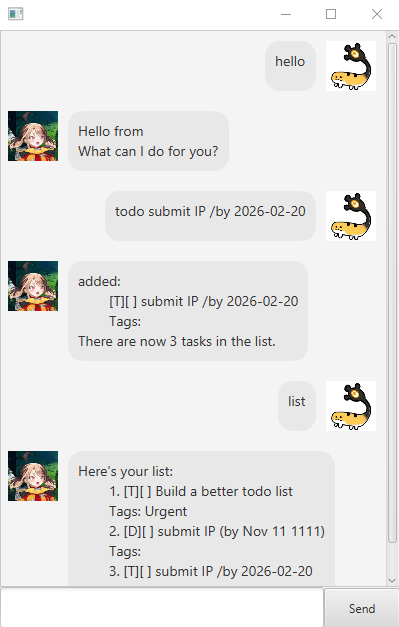

# Gigi User Guide

## Overview

Gigi is a personal assistant chatbot designed to help users track tasks through a command-line interface. This PR integrates several core architectural components:

## Features

1. **Greet the Chatbot**

   Use `hello` to start a conversation with the bot.

2. **Add Tasks**
   
    2.1 `todo <description>`: Adds a task without any date constraints.
    
    2.2 `deadline <description> /by <date>`: Adds a task with a specific due date. 

    2.3 `event <description> /from <start> /to <end>`: Adds a task that occurs during a specific time frame.

3. **View Tasks**

    `list`: Displays all current tasks in your list with their status and tags.

4. **Remove Tasks**

    `delete <index>`: Removes the task at the specified index from the list.

5. **Manage Tags**

    5.1 `tag add <index> <tag>`: Attaches a custom label to a specific task. 

    5.2 `tag remove <index> <tag>`: Removes an existing label from a task.

6. **Search Strings**

    `find <search string>`: Filters the task list to show items matching your query.

7. **Exit Program**

    `bye`: Closes the application.
   
## Data Storage

The application automatically saves your tasks to the local hard drive. This ensures that your list is preserved even after closing the program.

* **File Location**
  `./data/gigi.txt`

> **Note:** If the `data` folder does not exist, the program will automatically create it upon the first save. Do not manually edit the text file to avoid data corruption.

## Set-up

1. Ensure you have JDK 17 or above installed
2. Download the latest jarvis.jar from the [Releases](https://github.com/arcane-cs/ip/releases/) page
3. Open a terminal in the folder containing the jar file
4. Run the application using:
   `java -jar Gigi.jar`
8. Start managing your tasks!

## Project Resources

Refer to the original project [here](https://github.com/NUS-CS2103-AY2526-S2/ip/tree/master)
